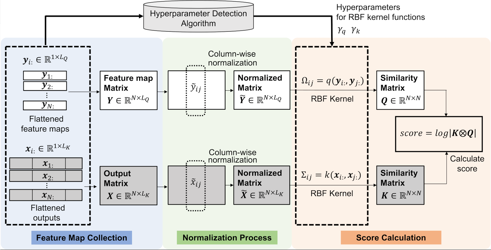

# RBFleX-NAS : Training-Free Neural Architecture Search Using Radial Basis Function Kernel and Hyperparameter Detection
Training-Free Neural Architecture Search (NAS) Using Radial Basis Function (RBF) Kernel 

## 🟨 Download the paper
Coming Soon...from IEEE Transactions on Neural Networks and Learning Systems.

## 🟨 What is RBFleX-NAS

Neural Architecture Search (NAS) is an automated technique to design optimal neural network architectures for a specific workload. Conventionally, evaluating candidate networks in NAS involves extensive training, which requires significant time and computational resources. To address this, training-free NAS has been proposed to expedite network evaluation with minimal search time. However, state-of-the-art training-free NAS algorithms struggle to precisely distinguish well-performing networks from poorly-performing networks, resulting in inaccurate performance predictions and consequently sub-optimal top-1 network accuracy. Moreover, they are less effective in activation function exploration.
To tackle the challenges, this paper proposes RBFleX-NAS, a novel training-free NAS framework that accounts for both activation outputs and input features of the last layer with a Radial Basis Function (RBF) kernel. 
We also present a detection algorithm to identify optimal hyperparameters using the obtained activation outputs and input feature maps. We verify the efficacy of RBFleX-NAS over a variety of NAS benchmarks. RBFleX-NAS significantly outperforms state-of-the-art training-free NAS methods in terms of top-1 accuracy, achieving this with short search time in NAS-Bench-201 and NAS-Bench-SSS. In addition, it demonstrates higher Kendall correlation compared to layer-based training-free NAS algorithms.
Furthermore, we propose NAFBee, a new activation design space that extends the activation type to encompass various commonly used functions. In this extended design space, RBFleX-NAS demonstrates its superiority by accurately identifying the best-performing network during activation function search, providing a significant advantage over other NAS algorithms.

## 🟨 Environmental Requirements
### For RBFleX-NAS
- Python version 3
- numpy
- torchvision
- torch
- scipy
- nats_bench

## 🟨 Download NAS Benchmarks
Our program works for [NAS-Bench-201 (NATS-Bench-TSS)](https://arxiv.org/abs/2001.00326), [NATS-Bench-SSS](https://arxiv.org/abs/2009.00437), [Network Design Space](https://arxiv.org/abs/1905.13214), and [TransNAS-Bench-101](https://arxiv.org/abs/2105.11871). If you want to apply our NAS algorithm, edit our program to meet other NAS benchmarks.

### NATS-Bench
To download the latest version, please visit the GitHub page of [NATS-Bench: Benchmarking NAS Algorithms for Architecture Topology and Size](https://github.com/D-X-Y/NATS-Bench). You can download the benchmark tar file of `NATS-tss-v1_0-3ffb9-simple.tar` and `NATS-sss-v1_0-50262-simple.tar` from [Google drive](https://drive.google.com/drive/folders/1zjB6wMANiKwB2A1yil2hQ8H_qyeSe2yt). After downloading these benchmark tar files, please store "NATS-tss-v1_0-3ffb9-simple.tar" on `./designspace/NAS-Bench-201/` and "NATS-sss-v1_0-50262-simple.tar" on `./designspace/NATS-Bench-SSS/`, respectively. And then, you may uncompress them by running `tar xvf NATS-tss-v1_0-3ffb9-simple.tar` and `tar xvf NATS-sss-v1_0-50262-simple.tar`.

### Network Design Space (NDS)
To download NDS benchmark json files, please visit the GitHub page of [On Network Design Spaces for Visual Recognition](https://github.com/facebookresearch/nds). You can download the benchmark json files from [this link](https://dl.fbaipublicfiles.com/nds/data.zip). After downloading these json files, please store all of json files on `./designsoace/NDS/`

### TransNAS-Bench-101
TransNAS-Bench-101 is put on this GitHub. You may not download TransNAS-Bench-101. To know the detail of TransNAS-Bench-101 benchmark, please visit the GitHub page of [TransNAS-Bench-101: Improving Transferability and Generalizability of Cross-Task Neural Architecture Search](https://github.com/yawen-d/TransNASBench). TransNAS-Bench-101 is stored on `./designsoace/Trans_Macro/` for Macro-level design space and `./designsoace/Trans_Micro/` for cell-level design space.

### NAFBee: Neural Network Activation Function Benchmark
This is a benchmark for networks with a variety of activation functions based on VGG-19 and BERT. NAFBee provides network information and accuracy. Users can obtain the accuracy without training.
To download NAFBee, please visit the GitHub Page of [NAFBee](https://github.com/tomomasayamasaki/NAFBee). NAFBee is stored on `./designsoace/NAFBee/`

## 🟨 Download image dataset
Our program works with three major datasets: CIFAR-10, CIFAR-100, ImageNet, Taskonomy, and SST-2.

### CIFAR-10 for NATS-Bench, NDS, and NAFBee(VGG-19)
This dataset is automatically downloaded on `./dataset/cifar10` by PyTorch after running our program. If you already have CIFAR-10 dataset in your environment, you may set your dataset path on root on each main program as follows.

### CIFAR-100 for NATS-Bench
This dataset is automatically downloaded on `./dataset/cifar100` by PyTorch after running our program. If you already have CIFAR-100 dataset in your environment, you may set your dataset path on root on each main program as follows.

### ImageNet or ImageNet16-120 for NATS-Bench and NDS
You may download a training set of ImageNet from [here](https://www.image-net.org). Before downloading, you should create an account on the website. After downloading it, please store the dataset in `./dataset/ImageNet`.
If you use ImageNet16-120 for NATS-Bench, please store the dataset in `./dataset/ImageNet16`. NATS-Bench GitHub explains the ImageNet16-120 dataset.

### Taskonomy for TransNAS-Bench-101
You may download Taskonomy RGB images as the dataset from [website](http://taskonomy.stanford.edu), and then put them in `./dataset/TASKONOMY/rgb`.

### SST-2 for NAFBee(BERT)
You may download SST-2 dataset in `./dataset/SST-2`.

